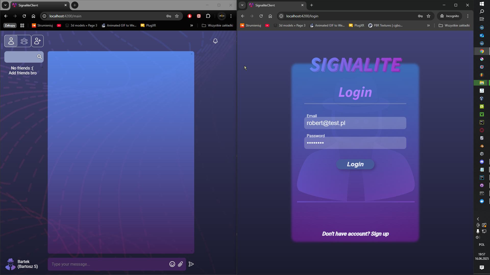
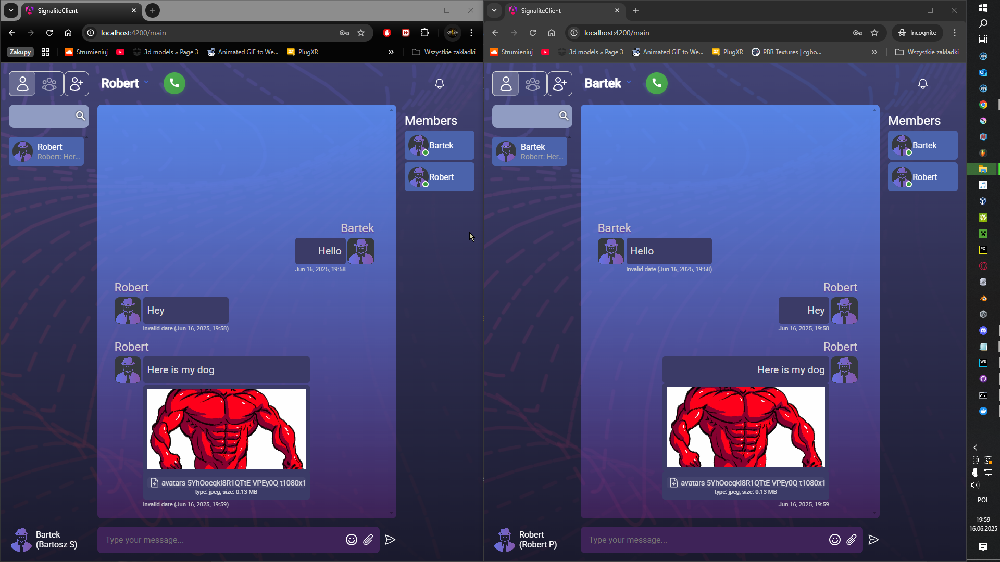
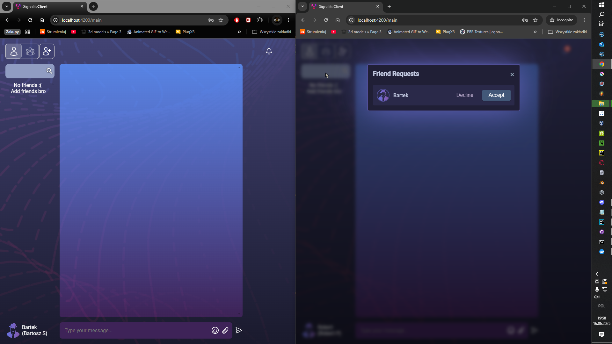
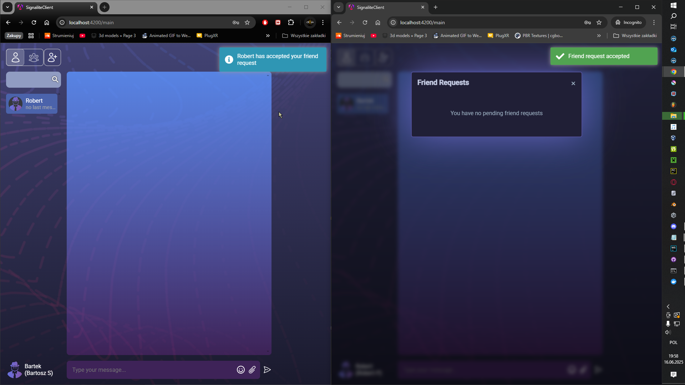
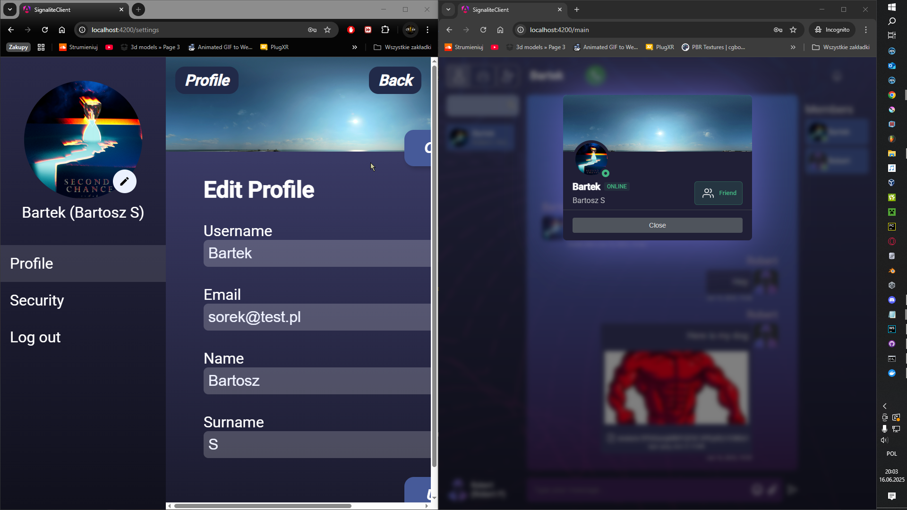
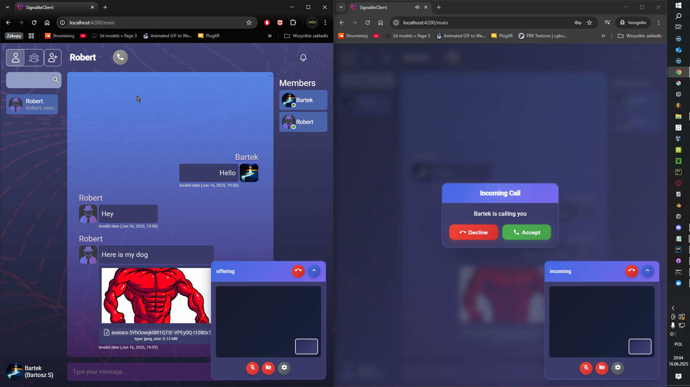
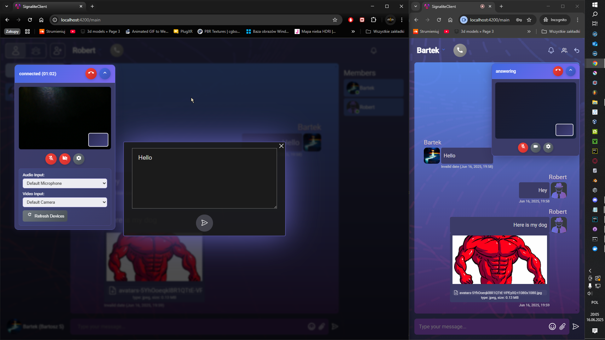

# SignaliteClient

   

A Communicator developed in Angular, enabling private and group conversations in real time.  Created to use with [SignaliteAPI](https://github.com/Signalite-org/SignaliteAPI)

## Authors

- [DarknesoPirate](https://github.com/DarknessoPirate)
- [filip_wojc](https://github.com/filip-wojc)
- [RobertPintera](https://github.com/RobertPintera)
- [HAScrashed](https://github.com/HAScrashed)

## Key Features

- **Real-time Messaging** - It’s possible to send messages in real time
- **WebRTC Voice/Video Calls** - Peer-to-peer audio and video communication
- **Authentication** - Users can register or login to their accounts
- **Group Managment** - It’s possible to create multi-user groups with specific names, group images; group owners are distinguished and have privileges to admin their groups
- **Friend System** - Users can add friends, accepts or deny invitations
- **Real-time Notifications** - Users receive live notifications about group modifications, friend requests, etc. 
- **Profile Management** - Users can modify their profile pictures and background banners
- **Presence tracking** - Logged-in users are displayed with filled green circle, offline users will appear with filled red circle
- **Responsive layout** - Main page look has been coded to look well in a wide range of possible window sizes & aspect ratios; ranging from super ultra wide (32x9) to smartphone screen sizes
- **Smooth pagination** - On-scroll message history loading
- **Message history cache** - Current conversation caches loaded messages from browsing history; cache size can be easily modified inside component

## Architecture
```
┌──────────────────────────────────────────┐     
│                  API                     |
│                Backend                   │     
└──────────────────────────────────────────┘     
                   ▲     
                   │  REST / WebSocket (SignalR)     
                   ▼     
┌──────────────────────────────────────────┐    
│             Angular services             │     
│          Handling API requests           │         
└──────────────────────────────────────────┘      
                   ▲      
                   │  business logic     
                   ▼      
┌──────────────────────────────────────────┐          
│            Angular Components            │             
│        Passing data from/to services     │                   
│           Handling user’s inputs         │                  
│             High-level UI logic          │                     
└──────────────────────────────────────────┘                     
                   ▲         
                   │  template + inputs/outputs         
                   ▼         
┌──────────────────────────────────────────┐         
│                 User                     │         
│  Interaction with the graphic interface  │         
└──────────────────────────────────────────┘         
```
## Tech Stack
### Core Technologies

- **Angular 19** - Modern TypeScript-based framework
- **Typescript** - typed language that compiles to JavaScript
- **CSS** -  Styling components
- **WebRTC** - Real-time peer-to-peer communication for audio and video calls

### Dependencies

- **Microsoft SignalR** - uses WebSockets for real-time events
- **Angular Animations** - Smooth UI transition and effects
- **RxJS** - Reactive programming for handling asynchronous data stream
- **Angular Material** - used mainly for material icons

### Environment Setup

1. **Clone the repository**
```bash
git clone <repository-url>
cd signaliteclient
npm install  (installs dependencies) 

```
**IMPORTANT:** fill the environment.development.ts or environment.ts files with the api ip address

2. **Install [API](https://github.com/Signalite-org/SignaliteAPI)**

3. **Start [API](https://github.com/Signalite-org/SignaliteAPI)**


4. **Start web application**

```bash
ng serve
```

## Preview of the web app
### Login screen

### Main screen

### Friend request

### Notifications

### Customisation, User profile

### Live calls

### Floating widget


## License

This project is part of an academic project by [DarknesoPirate](https://github.com/DarknessoPirate), [filip_wojc](https://github.com/filip-wojc), [RobertPintera](https://github.com/RobertPintera), [HAScrashed](https://github.com/HAScrashed)


